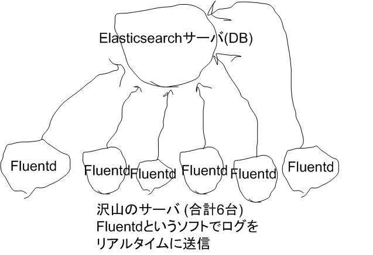

# オランダ的
# インフラ
# コントロール
# テクニック
# (ansible)

---

## 自己紹介
## 中村 勲

- 前職ではIaaSの設計・開発
- 現在はインフラ全般
- Python, Java, JS(node.js,angular.js), C#(Unity)

```
生まれは函館で帯広に引っ越して、それから小樽に行き、
稚内でロシア人とともに厳しい冬を越し、函館に戻る。
就職を期に埼玉に引っ越して、沼津の山奥に移り、
大自然を満喫した後に、神奈川に移住。
そして、現在は東京で都会人のフリをしています。
```

---

## オランダ的とは

- ロッベンのクロスをスナイデルがダイレクトボレーで合わせるような、
サイドから崩す手法
- 参考:アルゼンチン的 -> 中央から崩す手法


<!-- .slide: data-background="https://s3.amazonaws.com/hakim-static/reveal-js/reveal-parallax-1.jpg" -->


---

## インフラもサイドから崩す

- 中央突破は難しくても、サイドからの崩しで簡単に
  - 中央突破の例: インフラを全部コード化
  - サイド攻撃の例: 本当に困っている箇所だけコード化
- chefでもcapistranoでもfabricでも、psshでも、シェルスクリプトでも使い慣れたものでも、実現できれば良い
- 使い慣れたものがなければansibleで

---

## 2つの狙い

1. (前半戦)２つの簡単なインフラ改善ケースから、
日々のストレスを解消していく方法を考える
高速にインフラを改善していく方法について考える
日々のストレスを解消
特にスタートアップだと最近は開発者もインフラを何らかの形で触る機会が

2. (後半戦)改善テクニック、改善例

---

# 前半戦

---

## 前提

### インフラ管理はめんどう

- コマンド忘れた
- 社員が増えた
- サーバが重くなった
- 下手にいじると壊れそう

---

## ちょっとづつ改善
### 心得:時間をかけずに

- ケース1.サーバのユーザ管理
- ケース2.メンテナンス画面 

---

## 改善のための基盤作り

### ansible+jenkins+chatbot+commandの組み合わせ
- command -> jenkins -> ansible
- chatbot -> jenkins -> ansible


---

## サーバのユーザ管理(useradd的な)

### ありがちなケース

- サーバ数台~数十台
  - 手でやるのはつらい
  - インフラをコード化すると楽と聞いているけど、既存の環境をいじるのは怖い
- ユーザ管理の箇所だけコード化してみる

---

### ansibleを使った例

```
$ ansible-playbook -i hosts user.yml
$ cat user.yml
- hosts: appserver
  tasks:
  - user: name="nakamura" group="developer"
  - user: name="suzuki"   group="admin"
$ cat hosts
[appserver]
server1
server2
```

---

もちろん、シェルスクリプトでuseraddしてもよい
ansibleが便利なケース

途中でグループを変えたくなった。
->毎回書き直し(少しづつ複雑化
消したくなった。

ansibleだとオプション変えるだけ

---

## 更なる改善

### コマンドを叩くこと自体がめんどう
- たまにしかサーバログインしないのに、わざわざコマンド覚えたくない

-> コマンドを叩かないで実行
### 設定変更して、pushしたら自動的にansibleが実行されるようにする

---

## 更なる更なる改善

### 設定ファイルを変更すること自体がめんどう

### 設定外出し+
### chatbot or Jenkinsから実行(demo)

どこまでやるかは、懐事情と相談

---

### ケース2. メンテナンス画面

nginx設定とメンテナンスページを書き換える
課題が２つ
1.設定を書き換えて、サービスリスタートするのがめんどう
2.メンテナンスページを書き換えること自体がめんどう

1 -> touch maintenance-modeで瞬時にメンテナンスページを書き換え
-> サーバにログインしてそのコマンドを実行すること自体がめんどう
-> コピペする。コピペのための手順ページを開くこと自体がめんどう　緊急時は焦ってパニック状態
-> 間違ったサーバにログインして二次災害
2 ->  htmlで管理、書き換えるのが面倒。復数サーバに同じ設定入れるのが大変
直接diff取る(職人技)。外部からファイルを送る。gitからばらまく
可変箇所を変数化して外部から変更する


---
### 今日の話は全て小さな話し
時間をかけないことが大前提で、細かな改善はスピーディーに

もちろん、最初から全て完璧にコード化できれば問題ない
小さな改善で効果を示したり、成功体験を作った後に、大きな改善につなげていく


## 特性の違い
chatbot みんな確実に見ている。情報を集約できる
CIツール　履歴がジョブ毎にまとまる

---

# 後半戦
## 改善テクニック・例

---
ansible（インフラをコード化すると便利なこと）の便利な使い方
処理内容をpartsに分割できる->コピペをしないというプログラミングの考え方
テストもできる
jinja2
```
{parts/fluentd-redshift}
```

アプリサーバとアドミンサーバ
サーバによって必要なミドルウェアの設定は違う

サーバ毎によって設定ファイルを変える必要がある

fluentd


---

deployもansibleで(会社によってデプロイ方法は千差万別)

ELBの付け外し等簡単に実施可能
(便利な機能が沢山ある

```

---

# おまけ
# ec2signal
# muneoflight -> jenkinsデモ
# db scheme自動更新
# 可視化(kibana)

---


---
## ありがちな作業
1. ソフトのインストール
1. ソフトの設定変更
    - ホストによって設定内容が違う
        - リライト先の設定
        - 最大アップロード可能サイズ
    - サービス再起動

---

## ありがちな作業を手でやると
- ３台超えたぐらいからしんどい
    - １、３の法則 (１台、３台、１０台、３０台)
- 手作業によるミス
- 途中からわけわからなくなる


 
---

## 自動化して楽になりたい

--

<!-- .slide: data-background="#DDDDDD" -->
# でも

---

## chefを導入していない
## 今から導入するのは腰が重い
- もうシステムは動いている
- そんなに規模増えないし
- そんな工数かけられない

---

## 結論１：自動化は悪
## 新たな雇用を生み出そう！

--

<!-- .slide: data-background="#33CC99" -->
## イギリスの産業革命
- 工場制機械工業の導入により職を追われる人が急増
- 自動化すればいいというものではない
    - 手作業によりシステムに温かみ(バグ)が生まれる
    - 職人芸(バッドノウハウ)の尊重


--

# 職人芸とは
- かつて、jenkinsでビルドからデプロイに切替わるタイミングを目視監視し、そのタイミングに手作業で並列実行数を上げて高速化をしていた伝説の職人がいたそうな
    - 「ムネオさん、うちのデプロイテクニックは素人が数日で身につけれるモノじゃないんだよ」

---

## 雇用を生み出す余裕がない場合
### デプロイツールで簡単コマンド実行

---

## デプロイツール

複数サーバに並列でsshをつないでよしなにコマンド実行

別にデプロイしなくてもいい

- capistrano (Ruby)
    - Remote multi-server automation tool
- pssh, fabric (Python)
- cinnamon (Perl)

---

## Capistrano Example
my_secret_dirを複数ホストに作る

```
$ cat capfile
role :web, "192.168.1.110", "192.168.1.120"
task :secretdir, :roles => :web do
  run "mkdir my_secret_dir"
end

$ cap secretdir
```

---


## 気軽に使うならこれで十分

---

## 結論２：デプロイツールで解決
### これが簡単な解決方法

---

## サーバの構成管理もやりたい
### 構成管理ツールを導入
#### サーバ内の設定とサーバ間の構成をコード化して管理

- chef, puppet (Ruby)
- ansible (Python) 

---

# やっと登場
# ansible
### ～ 今度はしばらくchefの話になります ～

---


## 構成管理ってハードル高そう
### chef-serverはハードル高いらしい
### そこでchef-solo

---

# chef-solo
- ホスト1台に限定
  - chefブーム到来
      - vagrantと組み合わせて自分のPC内にLinuxマシンを簡単導入+自動セッティングみたいな
  - ハードルの低さ重要
- chef-soloをもっと簡単に使えるようにしたものがknife-solo

---

## 1台だけじゃつらい
### chef-soloで複数ホスト実行をうまくやるためには一工夫必要
#### (例：5台のfluentd設定ファイル書換え)
- Capistranoでchef-soloをキック (Ruby x Rubyの黄金コンビ)
    - Roundsman
- Knife Sous

---

## だんだんわけわからなくなってきましたか？
### = 始める前に覚えることが多い


---

<!-- .slide: data-background="#33CC99" -->
## そこでansible
### Ansible is simplest way to automate IT.

---

<!-- .slide: data-background="#FF9933" -->
## どれだけシンプルか
1. yum install ansible ( from epel )
1. 接続先にssh接続できること
1. やりたい処理を書く
1. Enjoy!

---

# 処理の書き方
## サーバ名一覧を準備
```
$ cat hosts
[webservers]
192.168.1.110
taro
jiro[1:5]
```
- jiro[1:5]とすればjiro1からjiro5まで実行可能

---

# dir作成
- サーバ名一覧を-iで与えて-aにコマンド書く
```
ansible -i hosts all -a 'mkdir my_secret_dir'
```

---

# これであなたも

---

# アンシブラー

---

## デプロイツール的にゆるく活用
### もっと本格的に
### 構成管理したくなったらコード化

---

# playbook
## 作業内容をコード化
```
$ cat secretdir.yml
- hosts: webservers
  tasks:
   - name: create my poem directory
     file: dest=my_secret_dir state=directory

$ ansible-playbook -i hosts secretdir.yml

```

---

## 実運用の困りポイント
- 規模が大きくなるとplaybookを分割しないときつい
- 開発環境と本番環境で設定が違う
- Front-WebサーバとAdmin-WebサーバとBackendサーバで共通な設定もあれば、共通でない設定も
- 複数プロジェクトを管理する場合の設定

---

## 管理方法の設計が必要
- ディレクトリを"適切に"分割して
- その中でplaybookを"適切に"配置して
- 変数部分を"適切な"ファイルに設定して


---

# 設計
# = ハードル高い

---

## ベストプラクティス
### ディレクトリ/ファイル構成をこんな感じにすれば大体いい感じになる構成例
- [ansible公式HP](http://docs.ansible.com/playbooks_best_practices.html)で公開
- 凄まじく便利
- 万能ではない
- そこで

---

# ムネオプラクティス
- ムネオ = 私
- ベストプラクティスを独自カスタマイズ
- ムラクティス

--

<!-- .slide: data-background="#007777" -->
# 近日

--

# 公開

--

<!-- .slide: data-background="#DDDDDD" --> 
##### 予定

---

<!-- .slide: data-background="#66CCFF" -->
# Ansible デモ
### カジュアルに検証環境を
### 破壊してみよう！

--

### カジュアルな
# システム構成図



---

## chefとansibleの違い
- できることは大体同じ
    - どちらも日々進化しており、良いライバル関係（妄想）
- chefはドキュメント豊富でWebに情報多い(印象)
- ansibleはインストールや設定が簡単で、始めるハードル低い
    - 5000台の運用実績

---

## ansibleから初めて、
## 不満があれば
## chefを使ってみては？

---

# おわり

---

# おまけ
- プレゼン資料はreveal.js+markdown+github pagesで作成しています。
- [ここ](https://github.com/n10o/ansible-technique)でソースを公開しているので・・・
