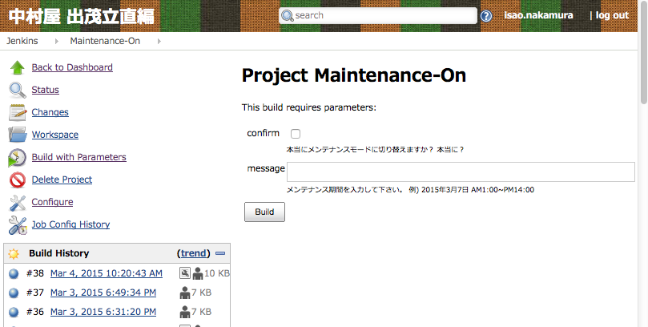

# オランダ的
### (中略)
# 総集編
# (ansible)

---

## 自己紹介

- 名前:中村 勲 (github:n10o)
- 前職:IaaSの設計・開発
- 現在:インフラ全般
- Python, Java, JS(node.js,angular.js), C#(Unity)

```
生まれは函館で帯広に引っ越し、それから小樽に行き、
稚内でロシア人とともに厳しい冬を越し、函館に戻る。
就職を期に埼玉に引っ越して、沼津の山奥に移り、
大自然を満喫した後に、神奈川に移住。
そして、現在は東京で都会人のフリをしています。
```

---

## オランダ的とは

- サッカー
- ロッベンのクロスをスナイデルがダイレクトボレーで合わせるような、
サイドから崩す手法
- 参考:アルゼンチン的 -> 中央から崩す手法


---

## インフラ改善もサイド攻撃

- 中央突破は難しくても、サイドからの崩しで簡単に
  - 中央突破の例: インフラを全部コード化
  - サイド攻撃の例: 本当に困っている箇所だけコード化

---

## 発表の流れ

1. (前半戦)２つのインフラ改善シナリオから、日々のストレスを解消する方法を考える

2. (後半戦)社内ツール紹介

---

# 前半戦

<!-- .slide: data-background="#66CCFF" -->

---

## 前提

### インフラ管理はめんどう

- コマンド忘れた
- 社員が増えた
- サーバが重くなった
- 下手にいじると壊れそう、怖い
- サーバ3台ぐらいから手でやるのはしんどい

---

## 2つのインフラ改善シナリオ

- ケース1.サーバのユーザ管理
- ケース2.メンテナンス画面

---

## サーバのユーザ管理

### ありがちなケース

- サーバ数台~数十台
  - 手でやるのはつらい
  - インフラをコード化すると楽と聞いているけど、既存の環境をいじるのは怖い
  - useraddのオプションなんだっけ？
- ユーザ管理の箇所だけコード化してみる
   - chefでもcapistranoでもfabricでも、psshでも、シェルスクリプトでもなんでも良い
   - 使い慣れたものがなければansibleで

---

## ansibleを使った例

```
$ ansible-playbook -i hosts user.yml
$
$ cat user.yml
- hosts: appserver
  tasks:
  - user: name="nakamura" group="developer"
  - user: name="suzuki"   group="admin"
$
$ cat hosts
[appserver]
server1
server2
```

---

## シェルスクリプトとの優位性

- 途中でグループを変えたくor消したくなった時
 - usermod, userdel
- オプション変えるだけで対応可能
- サーバの追加やグループ化も簡単

```
- user: name="nakamura" group="changed" state="absent"
```

---

## 更なる改善

### コマンドを叩くのがめんどう

- 解決案:設定変更して、pushしたら自動的にansibleが実行(webhook)
  - CIツールを利用: Jenkins, Wercker, CircleCI

---

## 更なる更なる改善

### 課題:設定ファイル変更自体がめんどう

目指す姿:hubot useradd nakamuraで全サーバにユーザ追加


1. 設定外出し(変数部分をjson化)
1. 設定ファイルをコントロールするコマンド作成(デモ)
1. chatbot or Jenkinsから実行

```
$ cat userlist.json
{
  "userlist":[
  { "name":"nakamura","uid":"123","group":"developer" },
  { "name":"suzuki","uid":"123","group":"admin",  "groups":"wheel" }
  ]
}
```

---

## ユーザ管理スクリプト実装例

```
- name: create user (name required)
  user: name={{ item.name }}
        uid={{ item.uid | default() }} # 指定しない場合はansibleデフォルトが入る
        password={{ item.password | default() }}
        group={{ item.group | default("developer") }} # 指定しない場合はdeveloper groupに入る
        groups={{ item.groups | default() }}
        update_password=on_create # パスワードを設定するのは初期作成時のみ
        state={{ item.state | default("present") }}
  with_items: userlist

- name: configure public key for develop
  authorized_key: user={{ item.name }} key="{{ lookup('file', 'dev/' + item.name + '.pub') }}"
  with_items: userlist
```

---

### ケース2. メンテナンス画面

- nginxの設定とメンテナンスページを書き換える
 - (作業1)設定変更+再読み込み
 - (作業2)メンテナンスページの書換

```
$ // 以下をサーバ台数分実行
$ vim maintenance-page.html <- メンテページを修正(日付入れたり)
$ vim /etc/nginx/maintenance.conf <- メンテナンスページを表示する設定を入れる
$ nginx -t <- 書き換えたコンフィグファイルに文法ミスはないかのチェック
$ service nginx reload <- 設定反映
```

---

## 改善案:Jenkinsから叩く



- デモ
- JenkinsはAPIが使えるので、chatbotからAPI叩けばchat経由でメンテ画面+文言切替も可能

---

## 内部の仕組み(その1)

### メンテページ表示の設定変更
 - 解決案:nginxの設定で特定の場所に適当なファイルを置くと、メンテナンスページを表示

```
// /var/tmp/maintenanceファイルを作成するとメンテモードになる
if (-f /var/tmp/maintenance) {
        set $maintenance 1;
}
```

- touch /var/tmp/maintenanceを全サーバで実行するスクリプトを書けば良い

---

## 内部の仕組み(その2)

### メンテページの日付文言変更
 - 解決案:日付の部分(可変箇所)を変数化

```
// Jenkinsで以下のシェルを実行
if [ ${confirm} == false ]; then
  exit 1
fi
ansible-playbook -i inventories/dev/hosts --extra-vars "message='${message}'" --tags="on" maintenance.yml

// maintenance.htmlの例 Jenkinsで入れたmessageの内容を埋め込むテンプレートを作れば良い
<p>本日のメンテナンス時間は{{ message }}を予定しています</p>
```

---

## 前半戦まとめ

- 小さな改善は時間をかけずスピーディーに
  - ansible+Jenkins等のCIツールがオススメ
  - JenkinsでUIやAPIを作って、それをchatbotやcommandを組み合わせて叩くと楽
- 小さな改善でツールに親しむ
  - ansibleは構成管理にもデプロイにも使えて便利

---

# 後半戦
## 社内ツールを一部紹介

<!-- .slide: data-background="#66CCFF" -->

---

## ec2signal
### デモ

- サーバの起動停止を開発者でも気軽に
- 開発者に必要な情報だけを見せる+高速絞込

---

## iOSアプリ配布ツール
### デモ

- 社内配布用(Developer Enterprise)ページ自動生成ツール
- Jenkinsかコマンドから実行可能
 - 実行すると、静的HTMLを生成する別ツールが動く

---

## db schemaページの自動作成
### デモ
### DBFluteの[SchemaHTML](http://dbflute.seasar.org/ja/manual/function/generator/task/doc/schemahtml.html)を使ってgitからとってくるだけ

---

## ログの可視化

- fluentd+elasticsearch+kibana
 - 鉄板構成
 - fluentd x ansibleの相性良し

- 評判が良い可視化項目
 - mysqlのスロークエリ
 - アプリログ（課金情報等）
 - アプリケーションエラー
 - メール送信情報
 - sensuのイベント -> 次のプレゼンで紹介

---

# おわり

<!-- .slide: data-background="#DDDDDD" -->

---

## 資料について
- プレゼン資料はreveal.js+markdown+github pagesで作成しています。
- [ここ](https://github.com/n10o/ansible-technique)でソースを公開しているので・・・

---

### ansibleの便利な使い方

- アプリサーバとアドミンサーバ
 - サーバによって必要なミドルウェアの設定は違う
 - サーバ毎によって設定ファイルを変える必要がある

- 処理内容をpartsに分割できる->コピペをしないというプログラミングの考え方
  - jinja2(template engine by python)

```
{parts/fluentd-redshift}
```

---

## deployもansibleで

- ELBの付け外し等簡単に実施可能
  -便利な機能が沢山

```
- name: Instance De-register
  local_action:
    module: ec2_elb
    instance_id: "{{ ansible_ec2_instance_id }}"
    state: 'absent'
    aws_access_key: "{{ aws_access_key }}"
    aws_secret_key: "{{ aws_secret_key }}"
    region: "{{ region }}
```

---

## インスタンス作成

- GUIで聞かれる内容をそのままコード化すれば良い

- コード化が気に入れば、terraform等で全体構成から設計
